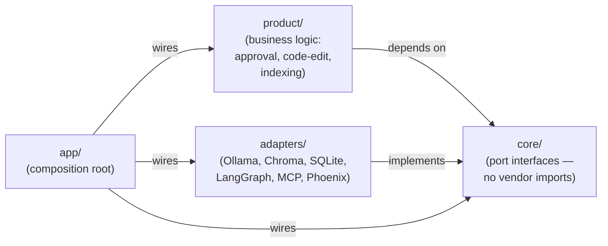
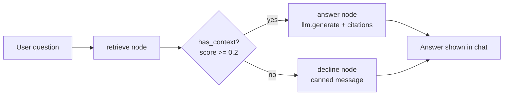
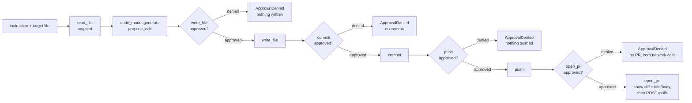

# Forge — Complete Workflow, Explained for a Java Developer

This document explains the whole application: what each layer does, how a
single request flows through it end to end, and what each phase built. Every
concept is mapped to its Java/Spring equivalent.

For what changed since the original design plan and why, see
[WORKFLOW_CHANGES.md](WORKFLOW_CHANGES.md).

## 1. What Forge does

Forge is a **self-hosted repo copilot**. From the chat UI, it indexes a
codebase (structure-aware: one chunk per function/class) and answers deep
questions about it, citing exact file and line numbers. It runs entirely on
your own machine (Ollama), so private code never leaves it.

Separately — wired and proven with real tests, but not yet reachable from
the chat UI — it can propose a code edit with a dedicated model and write it
to a sandboxed workspace, then commit and push that workspace's git history.
Both paths are gated behind human approval.

Think of it as a grounded Q&A assistant over your code, plus a separate,
approval-gated toolkit for making changes.

## 2. The mental model (this is the important part)

The architecture is **Ports and Adapters** — known in the Java world as
Hexagonal Architecture. If you have written Spring applications, you already
know it:

| Forge | Java / Spring equivalent |
|---|---|
| `core/` — port interfaces | Your `interface UserRepository { ... }` |
| `adapters/` — implementations | `class JpaUserRepository implements UserRepository` |
| `config.yaml` | `application.yml` / Spring profiles |
| `app/` — composition root | `@Configuration` classes building the bean graph |
| Swapping Ollama for a hosted API | Swapping H2 for PostgreSQL — change config, not code |

**The single rule that keeps this maintainable: dependencies point inward.**



- `core/` imports nothing — no vendors, no domain. Pure interfaces.
- `adapters/` know about vendors (Ollama, Chroma, SQLite, MCP) but not about Forge.
- `product/` knows about Forge (approval, code-edit, indexing) but never imports a vendor.
- `app/` is the only place that knows *which* adapter fills *which* port.

One deliberate exception: the Q&A decision graph's node functions
(`retrieve`/`has_context`/`answer`/`decline`) live in
`adapters/engine_langgraph.py`, not `product/`. They used to live in
`product/graph.py`, with the adapter importing them — but that meant
`adapters/` importing `product/`, backwards from the rule above. Since
LangGraph's `add_node`/`add_conditional_edges` wiring and the functions it
calls are inseparable in practice, they were merged into the adapter instead.
`core/engine.py` (the port everything else depends on) is unaffected either way.

This is exactly why Spring code compiles against `DataSource` and not against
`OracleDriver`. Same discipline, same payoff: every adapter swap so far
(Phoenix's client library, the MCP SDK, `pip` → `uv` in the Dockerfile) was a
one-file change, never touched `core/` or `product/`.

## 3. The layers, top to bottom

| Layer | Job | Tool | Java analogy |
|---|---|---|---|
| Interface | chat with the user | Chainlit | Your web tier (JSF/Thymeleaf/React front end) |
| Orchestration | decide route vs. decline | LangGraph (3-node graph) | A workflow/state machine engine (Camunda, Spring State Machine) |
| Knowledge | find relevant code | Chroma + raw Ollama embeddings | A vector index over your data |
| Reasoning | generate text/decisions | Ollama + Llama 3 family | A remote service you call — but non-deterministic |
| Action | do things in the world | MCP (official SDK), one local filesystem+git server | `@Service` beans exposed through a standard driver interface |
| State | remember across turns | SQLite (two separate files) | H2 embedded DB + HTTP session persistence |
| Observability | record what happened | Phoenix (Docker container) | Zipkin/Jaeger distributed tracing |
| Deployment | package and ship | Docker (`uv`-based build) | Same as you already know |

## 4. End-to-end flow: one user question

A user types in the Chainlit UI:

> "Where is the workspace sandbox path-escape check?"

**Step 1 — Interface (Chainlit).** `@cl.on_chat_start` assigns the browser
session a UUID `thread_id`; `@cl.on_message` runs `engine.ask()` off the
event loop via `asyncio.to_thread` (Ollama calls block, and must not block
Chainlit's async server). Java: a `@PostMapping` controller receiving a
request with a session ID, delegating the blocking call to a worker thread.

**Step 2 — Orchestration entry (LangGraph).** The compiled graph is invoked
with `{"question": ...}` and `config={"configurable": {"thread_id": ...}}`.
The `SqliteSaver` checkpointer (`.data/checkpoints.db`) loads or creates
state for that thread. Java: a process instance rehydrated from the DB,
carrying a context object.

**Step 3 — retrieve node.** Always runs first. Calls
`retriever.search(question, k=8)`.

**Step 4 — Knowledge (retrieval).** The question is embedded via
`nomic-embed-text` and compared against Chroma's stored vectors of
`{path, symbol, start_line, end_line}` per chunk — semantic search only.
Java: a Lucene index, but matching on meaning rather than keywords.

**Step 5 — has_context decision.** A plain Python function
(`adapters/engine_langgraph.py:has_context`), not a model call: if the top hit's score
is `>= MIN_RELEVANCE` (0.2), route to `answer`; otherwise route to
`decline`. This is a real branch in the compiled `StateGraph`
(`add_conditional_edges`), so it shows up as its own span in Phoenix.

**Step 6 — answer node.** Question + retrieved chunks + a system prompt go
to `llm.generate()` (`llama3:latest`), which returns the full answer. Java:
a synchronous call returning the whole response body.

**Step 7 — State.** The turn is checkpointed to `.data/checkpoints.db`
automatically as part of the graph's `invoke()` call. Java: `@Transactional`
commit plus session persistence.

**Step 8 — Observability.** Every step above emitted a span (`engine.ask`,
`retrieve`, `has_context`, `answer`, `llm.generate`, `retriever.search`,
`retriever.embed`) via manual OpenTelemetry spans plus LangGraph's own
auto-instrumented node spans, both landing in the same Phoenix trace tree.
Java: exactly a Zipkin trace with nested spans.

**Step 9 — Interface renders** the answer with a **Sources** list like
`math_utils.py:1`.



## 5. The other flow: code-edit, commit, push, open_pr

Four independent, approval-gated capabilities, each a plain Python function
call — not graph nodes, no checkpointed pause/resume:

- `product/code_edit.py:edit_file()` — reads a file (ungated), asks
  `code_model` (`llama3.2:1b`) for a full replacement, writes it via the
  `write_file` MCP tool
- `write_file`, `commit`, `push` — MCP tools on the same local server, each
  checked against `requires_approval` before running
- `open_pr` — not an MCP tool. `adapters/github_pr.py:OpenPrTool` implements
  `core.tools.Tool` directly against the GitHub REST API, so it stays out of
  the MCP server's stdio process (printing a diff there would corrupt the
  JSON-RPC channel that process's stdout doubles as). Reads `GITHUB_TOKEN`
  once, via `app/config_loader.py`'s `${GITHUB_TOKEN}` expansion —
  `adapters/github_pr.py` never touches `os.environ` itself.

The gate itself (`product/approval.py:run_tool`) is a synchronous callback:

```python
def run_tool(tool: Tool, kwargs: dict, approve: Approve) -> Any:
    if tool.requires_approval and not approve(tool, kwargs):
        raise ApprovalDenied(...)
    return tool.run(**kwargs)
```

`approve` is supplied by the caller. Java analogy: a guard clause that
raises `AccessDeniedException` if a passed-in `Supplier<Boolean>` returns
false — not (yet) a BPMN user task, since nothing here persists across a
restart.



Both `commit` and `push` run against `.data/workspace/`, a sandboxed
directory that `write_file`/`read_file` are also confined to (path-escape
checked in `_resolve()`). `_ensure_git_repo()` initializes that sandbox as
its own git repo on first use, with a local-only identity (`git config`
without `--global` — never touches your real git identity).

`open_pr` runs last, against that same workspace repo: it derives
`owner/repo` from its `origin` remote, computes `git diff base...head`, and
calls `self._display(...)` (defaults to `print`) with the title, body, and
full diff before making any HTTP request — so the only thing standing
between a human and an actual `POST /repos/{owner}/{repo}/pulls` is
`run_tool`'s `approve()` check. Because `run_tool` never calls `tool.run()`
when `approve()` returns `False`, a denied `open_pr` cannot reach the
network — proven against a real local HTTP server (not mocked) in
`app/open_pr_smoke_test.py`.

## 6. Where data lives

| Store | Holds | Java analogy |
|---|---|---|
| ChromaDB (`.data/chroma`) | vectors of code chunks + file/line metadata | Lucene index directory |
| SQLite (`.data/forge.db`) | generic `StateStore` key-value table (chat history is written here, one row per Q&A turn) | A generic `Map<String,Object>` table |
| SQLite (`.data/checkpoints.db`) | LangGraph's own checkpointed graph state, per `thread_id` — a separate file from `forge.db` | Process instance persistence |
| `.data/workspace/` (+ its own `.git/`) | the sandbox `write_file`/`commit`/`push` operate on | A scratch checkout, not your real repo |
| Your Git repo | the actual Forge source code | The system of record |
| Phoenix (Docker container) | traces of every run | Zipkin server |

## 7. The phases

Each phase was independently testable (`python -m app.*_smoke_test`) before
the next began.

| Phase | Layer | Status |
|---:|---|---|
| 1 | Scaffold (structure, config, smoke test) | done |
| 2 | Reasoning (Ollama adapter) | done |
| 3 | Knowledge (Chroma retriever) | done |
| 4 | Orchestration (3-node LangGraph: retrieve → has_context → answer/decline) | done |
| 5 | State (SQLite product store + LangGraph SQLite checkpointer) | done |
| 6 | Observability (Phoenix tracing) | done |
| 7 | Action (`read_file`/`write_file` MCP tools + approval gate) | done |
| 8 | Interface (Chainlit chat) | done |
| 9 | Deployment (Docker packaging) | done |
| 10 | Ingest source (`ast`-based structure-aware chunking) | done |
| 11 | Code-edit tool (dedicated `code_model` + gated `write_file`) | done |
| 12 | Commit/push tools (gated, sandboxed workspace) | done |
| 13 | `open_pr` tool (direct GitHub REST API adapter, same approval gate) | done |
| 14 | Task path (plan → approve → edit → test → retry ≤3 → commit, LangGraph) | done |
| 15 | Hybrid retriever (SQLite FTS5 lexical index + semantic, RRF fusion) | done |
| 16 | Chainlit Q&A: streaming answers, expandable citations, `/index` | done |
| 17 | Chainlit task-flow UI: plan card, Approve/Edit/Reject buttons, PR gate | done |
| 18 | `fetch_issue` tool (read-only GitHub issue fetch, `#N` detection in chat) | done |
| 19 | Run history (`runs`/`run_steps` tables, `core.run_history.RunHistory`, `python -m app.history`) | done |
| 20 | Approval gate on `interrupt()` + checkpoint (survives a restart), `python -m app.resume` | done |
| 21 | Conversation history in Chainlit (`/history`, resume/delete a thread) | done |
| 22 | Hosted (OpenAI-compatible) LLM adapter for `llm`/`code_model` | done |
| 23 | Q&A latency tuning (`answer_model`, per-path `num_ctx`, `keep_alive`, prompt trimming, `app/bench.py`) | done |

## 8. Upgrade path

Nothing below requires touching business logic — each is a config line plus,
at most, one new adapter file.

| Layer | Baseline (free) | Upgrade | Trigger |
|---|---|---|---|
| Reasoning | Ollama, local CPU | Hosted model API | Speed/quality — do this first |
| Retrieval | ChromaDB embedded | Qdrant (on-disk + quantized) | Past ~200-300k chunks |
| State | SQLite | PostgreSQL | Concurrent users |
| Observability | Phoenix (Docker, local) | Hosted Phoenix/tracing | Team needs shared access |
| Interface | Chainlit | Next.js | Real product UI |

Java: this is why you code against `DataSource`. Switching database vendors
is a config change, not a rewrite. Same principle, applied to every layer.

## 9. Glossary — AI terms in Java terms

- **LLM** — a service that takes text and returns text. Non-deterministic:
  the same input can produce different output. Design for that (validate,
  retry).
- **Token** — roughly ¾ of a word; the unit models read and bill in.
- **Context window** — the maximum tokens per call. A fixed-size buffer;
  overflow is silently dropped, so budget it explicitly.
- **Embedding** — text converted to a fixed-length numeric vector
  representing meaning. Similar meanings sit close together. Like a hash,
  except similar inputs produce similar outputs — the opposite of a
  cryptographic hash.
- **Vector database** — an index optimised for "find the nearest vectors."
  Lucene for meaning instead of keywords.
- **RAG (Retrieval-Augmented Generation)** — search first, then put the
  results into the prompt. A cache/DB lookup before rendering a template.
- **Agent** — an LLM in a loop that can choose tools and next steps. Forge's
  Q&A graph is *not* this (it's a fixed pipeline); the tool layer has the
  pieces an agent would use, but nothing decides *which* tool to call at
  runtime yet — the caller always specifies it explicitly.
- **Tool** — a function the model may call, described by a JSON schema. A
  `@Service` method published with an OpenAPI description. Here: an MCP
  tool, e.g. `write_file(path, content)`.
- **MCP (Model Context Protocol)** — a standard protocol for exposing tools
  to agents. JDBC, but for tools.
- **Checkpointer** — persists graph state after each step so a run can
  resume. Process instance persistence. Only covers the Q&A graph — the
  approval-gated tool calls are not checkpointed.
- **Human-in-the-loop / approval gate** — the run pauses and waits for a
  person before a mutating action. Today: a synchronous callback checked
  before a tool runs.
- **Hallucination** — the model states something false with confidence. The
  countermeasure is grounding (RAG) plus citations you can verify.
- **Temperature** — randomness. Low (0.0-0.3) for code and decisions; higher
  for creative text. (`config.yaml` sets `0.2` for the main model.)

## 10. What to keep in mind

1. **The model is a component, not the system.** Most of Forge is ordinary
   software engineering: interfaces, config, persistence, retries, tracing.
2. **Non-determinism is the real difference from Java services.** Never
   trust model output structurally — validate it, and constrain it with
   schemas.
3. **Ground everything.** Answers without citations are guesses.
4. **Gate every side effect.** Reads flow freely; writes stop for a human —
   true today for `write_file`/`commit`/`push`/`open_pr`, when the caller
   supplies an `approve` callback.
5. **Trace before you need it.** Observability came before Action, on
   purpose — every hard bug hit while building later phases was diagnosed
   partly by reading spans, not just stack traces.
6. **Keep the seams clean.** That is what makes the free stack upgradeable
   instead of disposable.

## 11. How to actually use Forge today

**A. Start it up**

```
ollama serve                              # if not already running
docker compose up -d phoenix              # tracing UI: http://localhost:6006
python -m app.run_chainlit run app/chainlit_app.py -w --port 8501
```

Not `chainlit run` directly, and not a native `phoenix serve` — see
`README.md` for why.

**B. Index a codebase**

There is no `/index` chat command yet. Indexing is a script, run once:

```
python -m app.ingest_smoke_test
```

This walks `forge.repo_path` from `config.yaml` (currently `.`, meaning
Forge indexes itself), chunks `.py` files per top-level function/class, and
writes them into the same Chroma collection the chat UI queries.

**C. Ask a question about the code**

Open `http://localhost:8501`, type a question. The full answer appears at
once with a **Sources** list of `path:line` citations underneath.

**D. Propose an edit, commit, push, open a PR**

Not reachable from the chat UI yet — call the workflow functions directly:

```python
from app.config_loader import load_config
from app.wiring import build_code_model, build_tools
from product.code_edit import edit_file

cfg = load_config()
code_model = build_code_model(cfg)
tools = {t.name: t for t in build_tools(cfg)}

edit_file(
    code_model, tools["read_file"], tools["write_file"],
    path="some_file.py", instruction="...",
    approve=lambda tool, args: True,   # your own approval logic goes here
)
```

`commit`/`push`/`open_pr` all follow the same `run_tool(tool, kwargs, approve)`
pattern:

```python
from product.approval import run_tool

run_tool(
    tools["open_pr"],
    {"title": "...", "body": "...", "base": "main", "head": "forge/task-..."},
    approve=lambda tool, kwargs: True,   # your own approval logic goes here
)
```

`open_pr.run()` prints the title, body, and full `git diff base...head`
before it ever calls the GitHub API, and returns the created PR's URL.

**E. Check what actually happened**

Open `http://localhost:6006` (Phoenix) to see every run as a trace tree:
which node executed, what was retrieved, tokens used, latency per step, and
any errors.

**F. Speed, quality, troubleshooting**

| Situation | What to change |
|---|---|
| Too slow while testing ideas | `llm.model: llama3.2:1b` in `config.yaml` (or whatever small model you have pulled) |
| UI loads but nothing responds | Ollama not running → `ollama serve`; or wrong model name in config vs. `ollama list` |
| Phoenix spans missing | Container not running → `docker compose up -d phoenix` |
| Approval gate errors immediately | The `approve` callback you passed isn't returning `True` |

## 12. Recommendations

In priority order:

1. **Move the approval gate onto LangGraph's `interrupt()`.** Today a denied
   approval just raises, and a pending approval only survives as long as the
   Chainlit session driving it (`_ask_plan_decision`/`_ask_pr_decision`
   block a background thread on `AskActionMessage`) — "close the tab, resume
   the same paused task tomorrow" isn't possible yet, even though the
   checkpointer needed for it already exists (Phase 5) and every task-graph
   node is checkpointed today.
2. **Enforce a context-token budget explicitly** before calling
   `llm.generate()` — nothing currently checks this.
3. **Keep `WORKFLOW.md` current, not a PDF.** Update Section 7's status
   table the same way `README.md`'s roadmap table gets updated, one phase at
   a time.

Resolved since these were last written: the Chainlit approval gate (Phase
17, `cl.AskActionMessage` Approve/Edit/Reject), `ProposedPR`/`PlanStep` (now
constructed by `product/planning.py` and rendered as the plan card), the
edit/test retry loop (Phase 14, capped at 3 attempts), and a lexical
pre-filter for retrieval (Phase 15, SQLite FTS5 + RRF fusion).
