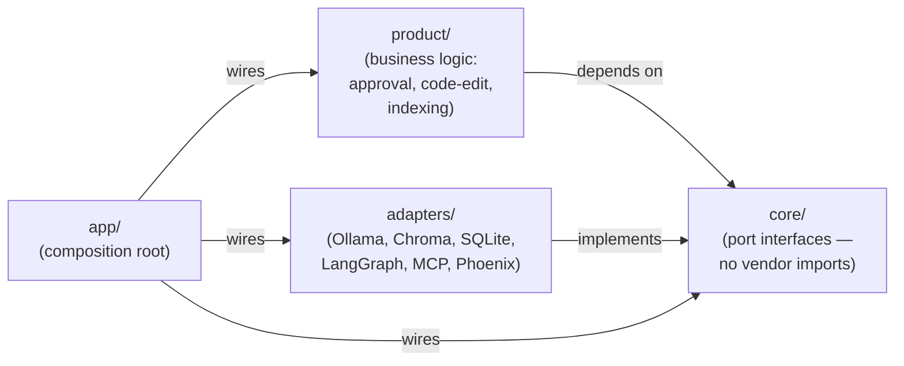
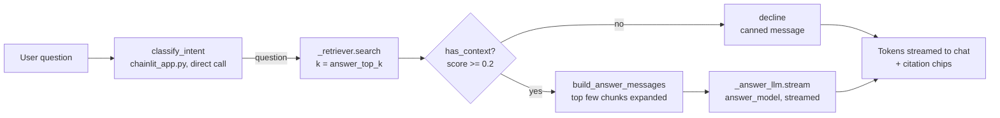
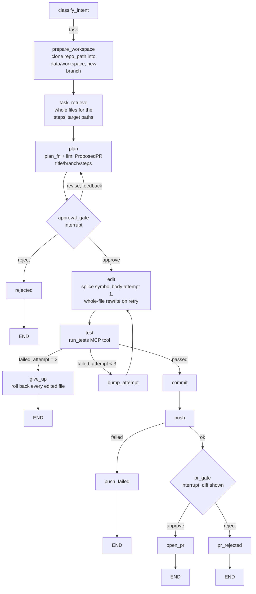

# Forge — Complete Workflow, Explained for a Java Developer

This document explains the whole application: what each layer does, how a
single request flows through it end to end, and what each phase built. Every
concept is mapped to its Java/Spring equivalent.

This originally replaced an earlier `WORKFLOW.pdf` design plan, and for a
while a separate `WORKFLOW_CHANGES.md` tracked every way the two diverged.
That document eventually became mostly historical trivia — nearly every
divergence it listed (hybrid retrieval, the restart-durable approval gate,
`open_pr`, the test-retry loop, most of the chat UI) had been resolved back
in line with the plan by Phase 23, so it was folded into Section 13 below
and removed rather than kept as a second, overlapping document.

## 1. What Forge does

Forge is a **self-hosted repo copilot**, and both of its paths are reachable
from the same chat UI (Chainlit, `http://localhost:8010` when run via
`scripts/run-stack.ps1`):

- **Q&A.** `/index <path>` indexes a repo (structure-aware: one chunk per
  function/class). Ask a question about it and get an answer with exact
  `path:line` citations.
- **Task path.** Describe a change ("fix ...", "add ...", "refactor ...", or
  mention a `#N` issue) and Forge classifies it as a task, proposes a plan,
  and shows it as a card with **Approve / Edit / Reject** buttons
  (`cl.AskActionMessage`, Phase 17). Approving runs edit → test (retry up to
  3 times, feeding failures back to the model) → commit → push → a second
  approval gate → `open_pr`.

Both paths run entirely on your own machine (Ollama), so private code never
leaves it, and every mutating step (`write_file`/`commit`/`push`/`open_pr`)
is gated behind human approval — nothing in the task path executes without
an explicit click.

One operational catch worth knowing up front: `/index <path>` only widens
what Q&A can retrieve. The task path always edits/tests/commits against
`config.yaml`'s `forge.repo_path` (read once, at startup) — indexing a repo
does not retarget what gets edited. If you want to edit a different repo
than the one you last indexed, `repo_path` has to point there too, and it
must be the exact directory containing `.git` — not merely somewhere
inside a git repo. A real project's actual git root and its build root
(where `package.json`/`pom.xml` lives) can differ; `repo_path` follows the
former, and `run_tests` now searches one level down for the latter — see
Section 5.

Think of it as a grounded Q&A assistant over your code, plus a chat-driven,
approval-gated workflow for making changes to a separately-configured repo.

## 2. The mental model (this is the important part)

The architecture is **Ports and Adapters** — known in the Java world as
Hexagonal Architecture. If you have written Spring applications, you already
know it:

| Forge | Java / Spring equivalent |
|---|---|
| `core/` — port interfaces | Your `interface UserRepository { ... }` |
| `adapters/` — implementations | `class JpaUserRepository implements UserRepository` |
| `config.yaml` | `application.yml` / Spring profiles |
| `app/` — composition root | `@Configuration` classes building the bean graph |
| Swapping Ollama for a hosted API | Swapping H2 for PostgreSQL — change config, not code |

**The single rule that keeps this maintainable: dependencies point inward.**



- `core/` imports nothing — no vendors, no domain. Pure interfaces.
- `adapters/` know about vendors (Ollama, Chroma, SQLite, MCP) but not about Forge.
- `product/` knows about Forge (approval, code-edit, indexing) but never imports a vendor.
- `app/` is the only place that knows *which* adapter fills *which* port.

One deliberate exception: the Q&A decision graph's node functions
(`retrieve`/`has_context`/`answer`/`decline`) live in
`adapters/engine_langgraph.py`, not `product/`. They used to live in
`product/graph.py`, with the adapter importing them — but that meant
`adapters/` importing `product/`, backwards from the rule above. Since
LangGraph's `add_node`/`add_conditional_edges` wiring and the functions it
calls are inseparable in practice, they were merged into the adapter instead.
`core/engine.py` (the port everything else depends on) is unaffected either way.

This is exactly why Spring code compiles against `DataSource` and not against
`OracleDriver`. Same discipline, same payoff: every adapter swap so far
(Phoenix's client library, the MCP SDK, `pip` → `uv` in the Dockerfile) was a
one-file change, never touched `core/` or `product/`.

## 3. The layers, top to bottom

| Layer | Job | Tool | Java analogy |
|---|---|---|---|
| Interface | chat with the user | Chainlit | Your web tier (JSF/Thymeleaf/React front end) |
| Orchestration | classify intent, then Q&A retrieval or the full task pipeline | LangGraph (~19 nodes: `classify_intent`/`retrieve`/`answer`/`decline` plus the whole task path — Section 5) | A workflow/state machine engine (Camunda, Spring State Machine) |
| Knowledge | find relevant code | Chroma + raw Ollama embeddings, optional SQLite FTS5 lexical fusion | A vector index over your data |
| Reasoning | generate text/decisions | Ollama + Qwen3 family (`llm`/`answer_model`/`code_model`, separately sized per use), or a hosted OpenAI-compatible API (Phase 22, config-only swap) | A remote service you call — but non-deterministic |
| Action | do things in the world | MCP (official SDK), one local filesystem+git server, plus a direct GitHub REST adapter for `open_pr`/`fetch_issue` | `@Service` beans exposed through a standard driver interface |
| State | remember across turns | SQLite (two separate files) | H2 embedded DB + HTTP session persistence |
| Observability | record what happened | Phoenix (Docker container) | Zipkin/Jaeger distributed tracing |
| Deployment | package and ship | Docker (`uv`-based build) | Same as you already know |

## 4. End-to-end flow: one user question

A user types in the Chainlit UI:

> "Where is the workspace sandbox path-escape check?"

**This path deliberately bypasses `core.engine.Engine.ask()`/the compiled
LangGraph** — a decision explained right in `app/chainlit_app.py`'s module
docstring: `Engine.ask()` only returns a finished (non-streamed) `Answer`,
and it always re-runs `classify_intent` internally, which
`chainlit_app.py` has already done itself by this point. Instead it calls
the same lower-level building blocks `Engine.ask()`'s Q&A branch uses
directly — `Retriever.search`, `has_context`/`decline`/
`build_answer_messages`, `LLMClient.stream` — so the logic isn't
duplicated, just not routed through the graph. (Contrast with Section 5's
task path, which *does* go through the real engine unchanged — reusing
`run_task()`'s plan/edit/test/retry/commit/push/PR machinery was the whole
point there; only *who answers its approval callbacks* is new.)

**Step 1 — Interface (Chainlit).** `@cl.on_chat_start` assigns the browser
session a UUID `thread_id`. `@cl.on_message` calls `classify_intent` first;
for a question, it awaits `_handle_question(question, thread_id)`, which
runs the retrieval/LLM calls via `asyncio.to_thread` (they block, and must
not block Chainlit's async server). Java: a `@PostMapping` controller
delegating a blocking call to a worker thread — but note there's no single
`ask()` call being delegated to; the controller method *is* the orchestration
here.

**Step 2 — Knowledge (retrieval).** `_retriever.search(question,
answer_top_k)` — a smaller `k` (`config.yaml`'s `retriever.answer_top_k`,
default 5) than the task path's general `top_k`, a Phase 23 latency choice.
The question is embedded via `nomic-embed-text` and compared against
Chroma's stored vectors of `{path, symbol, start_line, end_line}` per
chunk — semantic search only. Java: a Lucene index, but matching on meaning
rather than keywords. This step is manually traced (`retriever.search`,
`adapters/retriever_chroma.py`) independent of the graph, so it still
produces a Phoenix span even though nothing here goes through LangGraph.

**Step 3 — has_context decision.** A plain Python function
(`adapters/engine_langgraph.py:has_context`), not a model call: if the top
hit's score is `>= MIN_RELEVANCE` (0.2), continue to the answer step;
otherwise call `decline({})` for the canned message and stop. Unlike
Section 5's `approval_gate`, this is just a function call here, not a graph
conditional edge — there's no graph in this path to branch inside.

**Step 4 — Reasoning (answer).** `build_answer_messages(question, chunks,
max_expanded=answer_max_expanded)` builds the prompt (only the top few
chunks — `retriever.answer_max_expanded`, default 4 — get expanded to full
source text; the rest are referenced by location only, another Phase 23
latency trade). It's sent to `_answer_llm.stream(...)` — **not** the main
`llm` (`config.yaml`'s `answer_model` section, a smaller/faster model than
`llm.model`, wired separately in `chainlit_app.py` specifically so Q&A
answers don't pay the bigger model's latency) — with `answer_num_ctx` and
`keep_alive` from `config.yaml`. Tokens stream to the browser one at a time
via `cl.Message.stream_token()` as they arrive, not as one blocking call.
Java: closer to a `Flux<String>`/SSE response than a synchronous method
return.

**Step 5 — State.** No LangGraph checkpoint is written for this path (there's
no graph invocation to checkpoint) — instead, `_run_history.record_step()`
is called explicitly for each stage (`retrieve`, then `decline` or
`answer`), writing to the same `runs`/`run_steps` tables
(`core.run_history.RunHistory`) every graph node writes to automatically via
`_instrumented()`. This is what lets `/history` replay a Q&A transcript
later — the audit trail is unified even though the execution path isn't.

**Step 6 — Observability.** `retriever.search` and `llm.stream` each still
emit their own manually-instrumented span (defined in the adapters
themselves, independent of the graph) — but there's no `engine.ask`/
`retrieve`/`answer` parent span wrapping them the way Section 5's graph
nodes get one automatically, since nothing here calls into LangGraph.
Expect to see the leaf spans in Phoenix, not a full nested trace tree, for
this specific path.

**Step 7 — Interface renders** the streamed answer with expandable citation
chips underneath (`cl.Message(elements=_citation_elements(chunks))`), and
`config.yaml`'s `llm.show_timing` prints a one-line latency breakdown
(retrieve time, estimated prompt tokens, time-to-first-token, total,
tokens/sec) to the server console for tuning.



## 5. The other flow: the task path (plan → edit → test → commit → push → PR)

Unlike Section 4's Q&A path, this **is** a full LangGraph flow (`adapters/engine_langgraph.py`,
Phase 14/17/20) — every step below is a real graph node, and the two
approval points are real `interrupt()` calls checkpointed to
`.data/checkpoints.db`. Java analogy: a BPMN process with two user tasks,
not a guard clause — the run genuinely pauses, survives a restart, and
resumes from exactly where it left off (`/history` → Resume in the chat UI,
or `python -m app.resume <thread_id>` from a fresh process).

`classify_intent` routes a message here (rather than to `retrieve`) when it
starts with a task verb (`fix`/`add`/`refactor`/`implement`/`rename`),
mentions a `#N` issue, or an LLM call decides it's a task when neither regex
matches.



Notable behavior, some of it only visible once you've actually run a task:

- **`prepare_workspace` requires `forge.repo_path` to be the exact directory
  containing `.git`** (no uncommitted changes either) — it clones it into
  the sandbox and checks out a fresh branch there. Edits never touch the
  source directly. This bit hard in practice once: a real project's git
  root and its actual build root can differ (e.g. a wrapper directory with
  the app one level down, matching this project's own real upstream
  structure) — `repo_path` must be the *git* root, even if that's not where
  `package.json`/`pom.xml` live.
- **`run_tests` checks its exact working directory for build-system
  markers first, then falls back to searching one level down** (skipping
  `node_modules`/`.git`/etc.) before giving up — added after exactly the
  mismatch above: `repo_path` (hence the sandbox clone) can legitimately be
  a directory that isn't the JS/Java project's own root.
- **`edit`'s retry (attempt > 1) always does a whole-file rewrite**, not a
  re-splice at the original symbol's line numbers — those go stale the
  moment attempt 1 changes the file. Small local models can introduce
  subtle regressions here (e.g. dropping punctuation from CSS selectors)
  that a narrow test suite won't catch — review whole-file-rewrite diffs,
  don't trust "tests passed" alone.
- **`test` feeds the previous failure's output back into the next edit
  attempt's instruction**, so retries are informed, not blind repeats.
- **`give_up` restores every file it touched to its pre-edit content**
  before ending the run — a failed task leaves the repo exactly as it found
  it.
- `write_file`/`commit`/`push` are MCP tools on the local filesystem+git
  server (`adapters/mcp_servers/workspace_server.py`), each still checked
  against `requires_approval` via `product/approval.py:run_tool` — but by
  the time `commit_node`/`push_node` call them, the plan-level approval
  already covers the decision, so they pass an always-`True` callback
  rather than opening a second, redundant prompt per tool call.
- **`open_pr` is not an MCP tool.** `adapters/github_pr.py:OpenPrTool`
  implements `core.tools.Tool` directly against the GitHub REST API, kept
  out of the MCP server's stdio process (printing a diff there would
  corrupt the JSON-RPC channel that process's stdout doubles as). It
  derives `owner/repo` from the sandbox's `origin` remote, shows the title,
  body, and full `git diff base...head` at the `pr_gate` interrupt, and
  only calls `POST /repos/{owner}/{repo}/pulls` if that's approved.
- **Push can fail for a reason unrelated to the graph**: if `repo_path`'s
  host directory is bind-mounted read-only (`docker-compose.yml`'s
  `:ro` on `/mnt/host_projects`), the sandbox can commit fine but can't
  push back into it — `push_failed` ends the run with the git error, and
  nothing downstream (`pr_gate`/`open_pr`) runs.

## 6. Where data lives

| Store | Holds | Java analogy |
|---|---|---|
| ChromaDB (`.data/chroma`) | vectors of code chunks + file/line metadata | Lucene index directory |
| SQLite (`.data/forge.db`) | `run_history`'s `runs`/`run_steps` tables (Phase 19) — the audit trail behind `/history`, `python -m app.history`, and every graph node's automatic step logging. The generic `StateStore` key-value table also lives here (`core/store.py`, Phase 5) but its one prior real use — a parallel `chat:{thread_id}:{ts}` log — was removed in Phase 21 in favor of `run_history` alone, so it's currently unused by the live app. | A generic `Map<String,Object>` table (mostly dormant; the audit-log table next to it is what's actually load-bearing) |
| SQLite (`.data/checkpoints.db`) | LangGraph's own checkpointed graph state, per `thread_id` — a separate file from `forge.db` | Process instance persistence |
| `.data/workspace/` (+ its own `.git/`) | the sandbox `write_file`/`commit`/`push` operate on | A scratch checkout, not your real repo |
| Your Git repo | the actual Forge source code | The system of record |
| Phoenix (Docker container) | traces of every run | Zipkin server |

## 7. The phases

Each phase was independently testable (`python -m app.*_smoke_test`) before
the next began.

| Phase | Layer | Status |
|---:|---|---|
| 1 | Scaffold (structure, config, smoke test) | done |
| 2 | Reasoning (Ollama adapter) | done |
| 3 | Knowledge (Chroma retriever) | done |
| 4 | Orchestration (3-node LangGraph: retrieve → has_context → answer/decline) | done |
| 5 | State (SQLite product store + LangGraph SQLite checkpointer) | done |
| 6 | Observability (Phoenix tracing) | done |
| 7 | Action (`read_file`/`write_file` MCP tools + approval gate) | done |
| 8 | Interface (Chainlit chat) | done |
| 9 | Deployment (Docker packaging) | done |
| 10 | Ingest source (`ast`-based structure-aware chunking) | done |
| 11 | Code-edit tool (dedicated `code_model` + gated `write_file`) | done |
| 12 | Commit/push tools (gated, sandboxed workspace) | done |
| 13 | `open_pr` tool (direct GitHub REST API adapter, same approval gate) | done |
| 14 | Task path (plan → approve → edit → test → retry ≤3 → commit, LangGraph) | done |
| 15 | Hybrid retriever (SQLite FTS5 lexical index + semantic, RRF fusion) | done |
| 16 | Chainlit Q&A: streaming answers, expandable citations, `/index` | done |
| 17 | Chainlit task-flow UI: plan card, Approve/Edit/Reject buttons, PR gate | done |
| 18 | `fetch_issue` tool (read-only GitHub issue fetch, `#N` detection in chat) | done |
| 19 | Run history (`runs`/`run_steps` tables, `core.run_history.RunHistory`, `python -m app.history`) | done |
| 20 | Approval gate on `interrupt()` + checkpoint (survives a restart), `python -m app.resume` | done |
| 21 | Conversation history in Chainlit (`/history`, resume/delete a thread) | done |
| 22 | Hosted (OpenAI-compatible) LLM adapter for `llm`/`code_model` | done |
| 23 | Q&A latency tuning (`answer_model`, per-path `num_ctx`, `keep_alive`, prompt trimming, `app/bench.py`) | done |

## 8. Upgrade path

Nothing below requires touching business logic — each is a config line plus,
at most, one new adapter file.

| Layer | Baseline (free) | Upgrade | Trigger |
|---|---|---|---|
| Reasoning | Ollama, local CPU | Hosted, OpenAI-compatible API (Phase 22, `adapters/llm_openai_compatible.py`) — **already applied to `code_model`** in `config.yaml` today (`adapter: openai_compatible`, an OpenRouter fallback chain); `llm`/`answer_model` are still on Ollama and can be swapped the same way | Speed/quality — this one's done, per-port |
| Retrieval | ChromaDB embedded | Qdrant — **already available**, `adapters/retriever_qdrant.py`, same `Retriever` port/contract; flip `retriever.adapter: qdrant` in `config.yaml` (still defaults to `chroma`) | Past ~200-300k chunks, or just want Qdrant's on-disk/quantized options |
| State | SQLite | PostgreSQL | Concurrent users |
| Observability | Phoenix (Docker, local) | Hosted Phoenix/tracing | Team needs shared access |
| Interface | Chainlit | Next.js | Real product UI |

Java: this is why you code against `DataSource`. Switching database vendors
is a config change, not a rewrite. Same principle, applied to every layer.

## 9. Glossary — AI terms in Java terms

- **LLM** — a service that takes text and returns text. Non-deterministic:
  the same input can produce different output. Design for that (validate,
  retry).
- **Token** — roughly ¾ of a word; the unit models read and bill in.
- **Context window** — the maximum tokens per call. A fixed-size buffer;
  overflow is silently dropped, so budget it explicitly.
- **Embedding** — text converted to a fixed-length numeric vector
  representing meaning. Similar meanings sit close together. Like a hash,
  except similar inputs produce similar outputs — the opposite of a
  cryptographic hash.
- **Vector database** — an index optimised for "find the nearest vectors."
  Lucene for meaning instead of keywords.
- **RAG (Retrieval-Augmented Generation)** — search first, then put the
  results into the prompt. A cache/DB lookup before rendering a template.
- **Agent** — an LLM in a loop that can choose tools and next steps. Forge's
  Q&A graph is *not* this (it's a fixed pipeline); the tool layer has the
  pieces an agent would use, but nothing decides *which* tool to call at
  runtime yet — the caller always specifies it explicitly.
- **Tool** — a function the model may call, described by a JSON schema. A
  `@Service` method published with an OpenAPI description. Here: an MCP
  tool, e.g. `write_file(path, content)`.
- **MCP (Model Context Protocol)** — a standard protocol for exposing tools
  to agents. JDBC, but for tools.
- **Checkpointer** — persists graph state after each step so a run can
  resume. Process instance persistence. Covers the whole task-path graph
  (Section 5), including both `interrupt()` approval gates — a task paused
  mid-approval survives a restart. The live Q&A path (Section 4) bypasses
  the graph entirely by design, so there's nothing there to checkpoint;
  `run_history` covers its audit trail instead.
- **Human-in-the-loop / approval gate** — the run pauses and waits for a
  person before a mutating action. In the task path: a real
  `langgraph.types.interrupt()` call, checkpointed, resumable from a
  different process (`/history` → Resume, or `python -m app.resume`). Tool
  calls underneath (`write_file`/`commit`/`push`/`open_pr`) additionally go
  through `product/approval.py:run_tool`'s synchronous `requires_approval`
  check, but by the time the task graph calls them the plan-level approval
  already covers the decision.
- **Hallucination** — the model states something false with confidence. The
  countermeasure is grounding (RAG) plus citations you can verify.
- **Temperature** — randomness. Low (0.0-0.3) for code and decisions; higher
  for creative text. (`config.yaml` sets `0.2` for the main model.)

## 10. What to keep in mind

1. **The model is a component, not the system.** Most of Forge is ordinary
   software engineering: interfaces, config, persistence, retries, tracing.
2. **Non-determinism is the real difference from Java services.** Never
   trust model output structurally — validate it, and constrain it with
   schemas.
3. **Ground everything.** Answers without citations are guesses.
4. **Gate every side effect.** Reads flow freely; writes stop for a human —
   true today for `write_file`/`commit`/`push`/`open_pr`, when the caller
   supplies an `approve` callback.
5. **Trace before you need it.** Observability came before Action, on
   purpose — every hard bug hit while building later phases was diagnosed
   partly by reading spans, not just stack traces.
6. **Keep the seams clean.** That is what makes the free stack upgradeable
   instead of disposable.

## 11. How to actually use Forge today

**A. Start it up**

```
powershell -File scripts\run-stack.ps1
```

Run from the repo root. This is a Docker Compose stack, not a native
`chainlit run`/`phoenix serve` — see `README.md` for why. It brings up, in
order: Ollama (native host process — starts it if not already running),
Phoenix (`http://localhost:6006`), then Forge itself (`http://localhost:8010`),
verifying each is actually reachable before starting the next.

Setting this up on a different machine? `docs/TEAM_SETUP.md` is the
condensed, Docker-first walkthrough for that — this section assumes you're
already set up and explains how to use it day to day.

**B. Index a codebase**

Type in the chat:

```
/index <path>
```

`<path>` must be reachable *inside the Forge container* — if it's an
in-repo path this is trivial (e.g. `/index .`), but a path outside the
container needs a bind mount added to `docker-compose.yml`'s `forge`
service first (`- C:/some/host/path:/mnt/host_projects:ro`), then
`/index /mnt/host_projects/...`. This walks the path, chunks `.py`/`.js`/
`.ts`/`.go`/`.java` files per top-level function/class (whole-file for
everything except Python — no per-symbol chunker exists for the others),
and writes them into Chroma. **This only affects Q&A** — see the callout
in Section 1 about why it doesn't retarget the task path.

Two more forms, both additive since the original `/index <path>`:

- `/index <path> --changed` — reindexes only files that differ from `HEAD`
  in the working tree (`adapters/ingest_fs.py:changed_paths()`, via `git
  diff --name-status HEAD` + `git ls-files --others`), and purges deleted
  files' chunks via `Retriever.delete(paths)`. Much faster than a full walk
  once a repo's already indexed — use it right before a commit so the index
  reflects what you're about to commit without re-embedding everything else.
  Same flag works from the CLI: `python -m app.index <path> --changed`.
- `/index --clear` — wipes the entire index (`Retriever.clear()`, every
  adapter: Chroma/Qdrant/FTS/Hybrid), behind an `AskActionMessage`
  confirmation (same pattern as deleting a conversation thread).

**`/index`ing the same path twice under two *different* root paths for the
same repo still creates duplicates, not updates** — this bit us for real:
`/index` had been run against both a repo's git root and its app subfolder
one level down, and since Chroma path metadata is relative to whatever path
was passed in, every file ended up indexed twice under different prefixes
(`repo/src/...` vs `src/...`), both permanently retrievable. `Retriever`'s
`delete()`/`clear()` only dedup an *exact* repeated path — this cross-root
case isn't caught automatically. If it happens, `/index --clear` then a
single clean `/index <the-one-true-path>` fixes it; going forward, always
index the same root (match `forge.repo_path`) and never a subfolder of it.

**C. Ask a question about the code**

Open `http://localhost:8010`, type a question. The answer streams in with
expandable citation chips underneath.

**D. Propose an edit, commit, push, open a PR**

Type a change request in the same chat, e.g. `Add a logout button to
shell.component.ts` — lead with a verb (`fix`/`add`/`refactor`/`implement`/
`rename`) so it's classified as a task deterministically rather than by an
LLM guess. Forge clones `forge.repo_path` into a sandboxed workspace on a
fresh branch, shows a plan card, and pauses for **Approve / Edit / Reject**.
Approving runs edit → test (up to 3 attempts, each retry given the previous
failure's output) → commit → push → a second approval gate before `open_pr`.

If a run gets stuck at an approval gate in a dead/reconnecting browser tab
(the plan state is checkpointed server-side, independent of any one
session), recover it with `/history` → find the thread → **Resume**, or
from a fresh process entirely with `python -m app.resume <thread_id>`.

**E. Check what actually happened**

Open `http://localhost:6006` (Phoenix) to see every run as a trace tree:
which node executed, what was retrieved, tokens used, latency per step, and
any errors.

**F. Speed, quality, troubleshooting**

| Situation | What to change |
|---|---|
| Too slow while testing ideas | `llm.model` in `config.yaml` — use the smallest model you have pulled |
| UI loads but nothing responds | Ollama not running → check `docker logs forge-forge-1`; or wrong model name in config vs. `ollama list` |
| Phoenix spans missing | Container not running → re-run `scripts\run-stack.ps1` |
| "Retrieving..."/a plan never resolves | Check `docker stats forge-forge-1` — near-idle CPU with no new log lines means the message never reached the backend (dead browser session), not a slow model. Refresh and resend |
| `push`/`open_pr` fails with a git object-directory error | `forge.repo_path`'s host directory is bind-mounted read-only (`:ro`) — Forge's sandbox clone can commit fine, but can't push back into a read-only source. Either make the mount read-write, or treat push as a manual step done outside Forge once tests pass |
| A JS/TS `run_tests` step needs a browser | The image installs `nodejs`/`npm`/`chromium` and sets `CHROME_BIN`; a project's own `npm test` still needs its own karma/jasmine (or equivalent) config and devDependencies — Forge doesn't scaffold those for you |
| `prepare_workspace` fails with "is not a git repository" | `repo_path` isn't the exact directory containing `.git` — check `git rev-parse --show-toplevel` on the real repo and point `repo_path` at that, even if it's not where `package.json`/`pom.xml` lives (`run_tests` searches one level down for those on its own) |
| A plan targets the wrong file for an obviously-relevant query | Check both retriever halves directly: `retriever.search(query, k=...)` (semantic+lexical fused) and, if it's a non-Python file, whether the literal text you expect is even in a *content*-indexed column — `adapters/retriever_fts.py`'s FTS5 table only started indexing `content` (not just `symbol`/`signature`/`path`) after a real miss; a stale index built before that fix, or one with duplicate stale-path entries from indexing two different roots of the same repo, won't have this signal until you `/index --clear` and re-`/index`. If it's not a one-off, add the question to `eval/dataset.yaml` and run `python -m eval.run` (Section 11G) — turns a one-time debugging session into a permanent regression case |

**G. Check retrieval quality**

```
python -m eval.run
```

Runs `eval/dataset.yaml`'s fixed question set (known-correct
file/symbol per question) against the live retriever and prints
hit@k/MRR/precision@k plus a per-case PASS/FAIL table — the systematic
version of the troubleshooting row above, instead of re-deriving the same
check by hand each time a plan looks off. `--k` shows how the metrics move
with top-k; `--compare` (with `--compare-k` or `--compare-config`) runs the
suite twice and prints a side-by-side table, so a chunking or `top_k`
change can be shown to have helped or hurt instead of eyeballed. See
`README.md`'s "Retrieval quality eval" section for the full flag list.

Wired as a CI regression gate — `.github/workflows/retrieval-eval.yml`
runs this on every push/PR to `main` and fails the job if `hit@k` drops
below threshold. **Self-hosted runner only**: the Chroma index, lexical
DB, and `.env` are gitignored local state that only exists on a machine
already running Ollama with a repo indexed (same constraint as `/index`
above) — see that workflow file's header comment.

## 12. Recommendations

In priority order:

1. **Enforce a context-token budget explicitly** before calling
   `llm`/`answer_model`/`code_model`'s `generate()`/`stream()` — nothing
   currently checks this. `llm.answer_num_ctx`/`edit_num_ctx` (Phase 23)
   right-size the *context window per path*, which is a different thing
   from validating or truncating a specific outgoing prompt against a
   budget before it's sent.
2. **Keep `WORKFLOW.md` current, not a PDF.** This document itself is the
   ongoing proof of how fast that drifts without deliberate effort — update
   it the same way `README.md`'s roadmap table gets updated, one phase (or
   one architectural change) at a time, not just at phase boundaries.

Resolved since earlier versions of this document: the Chainlit approval
gate (Phase 17, `cl.AskActionMessage` Approve/Edit/Reject);
`ProposedPR`/`PlanStep` (now constructed by `product/planning.py` and
rendered as the plan card); the edit/test retry loop (Phase 14, capped at 3
attempts); a lexical pre-filter for retrieval (Phase 15, SQLite FTS5 + RRF
fusion); and — the last item on this list for a long time — **moving the
approval gate onto LangGraph's `interrupt()`** (Phase 20): a denied approval
no longer just raises, and a pending approval survives a restart and a dead
browser session, resumable via `/history` → Resume or
`python -m app.resume <thread_id>` — see Section 5.

## 13. What still differs from the original plan (and what's new that it never anticipated)

The original `WORKFLOW.pdf` plan predates almost everything in this
document. By Phase 23, nearly every divergence from it had resolved back in
line with the plan — hybrid retrieval, the restart-durable approval gate,
`open_pr`, the test-retry loop, most of the chat UI, and more were all
"planned but not built" at one point and are now just... built (see the
phase table, Section 7). What's left are a handful of permanent
architectural decisions, plus two things the plan never saw coming at all.

**Permanent divergences:**

- **Format: PDF → this Markdown file.** A binary PDF doesn't diff or review
  in a PR and drifts out of sync fast — this file's own history before this
  round of fixes was the proof.
- **Knowledge layer: LlamaIndex + Chroma → raw Ollama embeddings + Chroma.**
  LlamaIndex sat in `requirements.txt` unused; Phase 9 removed it.
- **Chunking: tree-sitter → stdlib `ast`, Python-only** (Phase 10), **then
  tree-sitter came back for JS/TS/Java specifically** (Phase 10 extended,
  once the project's actual daily-driver target repo became the Angular/TypeScript
  `rag-frontend-angular-v2` and a Java repo started getting indexed
  periodically too — Go was considered too, but isn't an active target repo,
  so it deliberately stays on whole-file chunking rather than adding a
  grammar nothing currently needs). Whole-file-only chunking for JS/TS/Java
  had a concrete cost beyond retrieval: `product/code_edit.py`'s edit step
  could only scope an edit to a whole file (often ~one class per file in
  both languages), not one method — every edit meant regenerating the entire
  file. `adapters/ingest_fs.py`'s `_ts_chunks` now gives JS/TS/Java the
  same per-method/function chunk granularity Python already had via
  `_python_chunks`, walking one level into class/interface bodies since a
  typical Angular component or Java class puts nearly all its code inside
  one class per file (class-level-only chunking would have collapsed right
  back to whole-file size for exactly these two languages). Two real-repo
  bugs caught only by testing against the actual indexed repo, not the
  isolated unit tests: (1) `export class Foo {}` — virtually all real
  Angular/TS code — parses as an `export_statement` wrapping the actual
  `class_declaration`, so without unwrapping it nothing matched and 0
  chunks came out; (2) Angular's modern functional-guard/interceptor
  pattern (`export const authGuard: T = (route, state) => {...}`) is a
  `lexical_declaration` bound to an arrow function, not a
  `function_declaration`, and needed its own extraction path.

  Before this, non-Python languages got a placeholder `symbol` (`"<file>"`)
  and a useless first-line `signature`, so `adapters/retriever_fts.py`'s
  lexical index — originally `symbol`/`signature`/`path` only — had *no*
  content-based signal for any JS/TS file, just filename matching. A real
  task surfaced this: a query containing the literal text of a button's
  `title` attribute in `shell.component.ts` returned zero lexical hits and
  didn't rank in the fused top-8, purely because that text lived in the one
  column (`content`) the FTS5 table left `UNINDEXED`. Fixed by indexing
  `content` at a low BM25 weight (0.5, well under `symbol`'s 5.0) — low
  enough to barely move Python chunks' already-good ranking, high enough to
  give whole-file chunks a real content-based signal for the first time.

  **`_ts_chunks` also attaches a chunk's leading doc-comment (JSDoc/Javadoc)
  when present**, since dropping it would lose exactly the kind of
  high-signal text (`/** Attaches the JWT to every request... */`) that made
  whole-file chunks retrieve correctly before. That surfaced a real bug in
  `_signature()` (`adapters/retriever_fts.py`): it took "the chunk's first
  non-blank line" as the searchable `signature` column (BM25 weight 2.0,
  second only to `symbol`'s 5.0) — with a leading comment now included, that
  first line became the comment opener (`/**`, no useful terms) for
  multi-line doc comments, or the *entire* doc comment for single-line ones,
  either way replacing the real declaration line `signature` exists to
  capture, and in the single-line case actively corrupting ranking (whichever
  chunk's doc comment happened to share words with the query got an
  undeserved weight-2.0 boost). Fixed by making `_signature()` skip leading
  `//`/`/* */`/`/** */` comment lines to find the real first code line.
  Verified against `app/ingest_smoke_test.py`'s two hardcoded auth-code
  queries: the auth-guard query passes; the auth-interceptor query still
  ranks `AuthService.getRole` above `authInterceptor` in the hybrid-fused
  top-1 despite `authInterceptor` scoring higher semantically (0.29 vs
  0.20) — RRF gives the two an *exactly tied* fused score (their semantic
  and lexical ranks are simply swapped, 1↔2, between the two sub-searches),
  and the tie-break rule in `adapters/retriever_hybrid.py`'s `sort_key`
  explicitly favors the better lexical rank, which `getRole` narrowly wins
  even after the signature fix (its remaining lexical edge is now just
  content-column term-frequency/length-normalization noise, not a bug).
  That tie-break rule exists deliberately, for a good reason (an identifier-
  shaped query like "where is validateToken called?" should trust an exact
  lexical match over fuzzy cosine similarity) — but it doesn't distinguish
  that case from a natural-language question with weak, incidental lexical
  overlap, where semantic score is the more trustworthy signal. Changing it
  risks regressing the exact-match case it was built for, so it's left
  as-is: a known, narrow, well-diagnosed open question, not a bug to chase
  further here.
- **State: one SQLite file → two.** `.data/forge.db` (`run_history`'s
  `runs`/`run_steps`, Phase 19) and `.data/checkpoints.db` (LangGraph's
  checkpointer) were never merged into the plan's single-file vision.
- **Observability: native `phoenix serve` → Docker container**, and
  **deployment: bind-mounted `.data/` → named Docker volume** — both forced
  by real build/runtime failures on this machine (a C++ toolchain
  `sqlean-py` needs, and SQLite locking over Docker Desktop's Windows
  bind-mount translation), not a design preference.

**Two things the original plan never anticipated:**

- **The Q&A path bypasses the engine/graph entirely** (Phase 16, refined in
  Phase 23) — streaming a response requires it, since `Engine.ask()` only
  returns a finished, non-streamed `Answer`. See Section 4.
- **`code_model` defaults to a hosted API, not local Ollama, in the
  checked-in `config.yaml`** (Phase 22) — a real break from this project's
  original "`$0`, fully local" premise for that one slot specifically (`llm`/
  `answer_model`/`embeddings` all stay local). Skip filling in
  `CODE_MODEL_NAME`/`CODE_MODEL_API_KEY`/etc. in `.env` and the code-edit
  step of the task path silently doesn't work — see `README.md`'s "Upgrade
  path" section for the actual config shape and how to revert it to Ollama.

**Additive extras since Phase 23 (not numbered phases — off by default, no
protected file touched):**

- **`notify_slack` tool** (`adapters/tool_slack.py`) — an optional Slack
  ping ("task complete", "PR opened: `<url>`") at a task run's natural end
  points, wired through `core.tools.Tool` like any other tool. No-op unless
  `SLACK_WEBHOOK_URL` is set; a failed post is caught and logged, never
  raised, so it can't fail the run it's reporting on. See README's
  "Optional add-ons" section.
- **Qdrant retriever** (`adapters/retriever_qdrant.py`) — a sibling to
  `retriever_chroma.py` behind the same `Retriever` port, same
  skeleton-index contract, proving the port genuinely supports swapping
  vector stores. `retriever.adapter` still defaults to `chroma`. See the
  Upgrade path table (Section 8) and README's "Optional add-ons" section.
- **`/index --changed` and `/index --clear`** (Section 11B) — incremental
  reindex and full wipe, on top of the original full-walk `/index <path>`
  (unchanged, still the default). Needed a small port addition,
  `Retriever.delete(paths)`/`Retriever.clear()`, implemented on every
  retriever adapter (Chroma/Qdrant/FTS/Hybrid) — see
  `app/incremental_index_smoke_test.py`. Java (`.java`) joined the indexed
  languages at the same time.
- **Retrieval-quality eval harness** (`eval/dataset.yaml` + `eval/run.py`,
  Section 11G) — a fixed set of questions with known-correct files/symbols,
  scored automatically through the existing `Retriever.search()`, no new
  port or interface. Prints hit@k/MRR/precision@k plus a per-case
  PASS/FAIL table; `--compare` runs it twice (two `top_k` values, or two
  configs) for a before/after comparison. Wired as a CI regression gate in
  `.github/workflows/retrieval-eval.yml`, `runs-on: self-hosted` — the
  Chroma index, lexical DB, and `.env` it depends on are all gitignored
  local state with no GitHub-hosted-runner equivalent, so the workflow
  reuses whatever's already indexed on the runner's own machine
  (`clean: false` on checkout so a normal `git clean -ffdx` doesn't wipe
  them between runs). No self-hosted runner is registered for this repo
  yet, so the workflow queues rather than runs until one is (repo Settings
  → Actions → Runners → New self-hosted runner).
